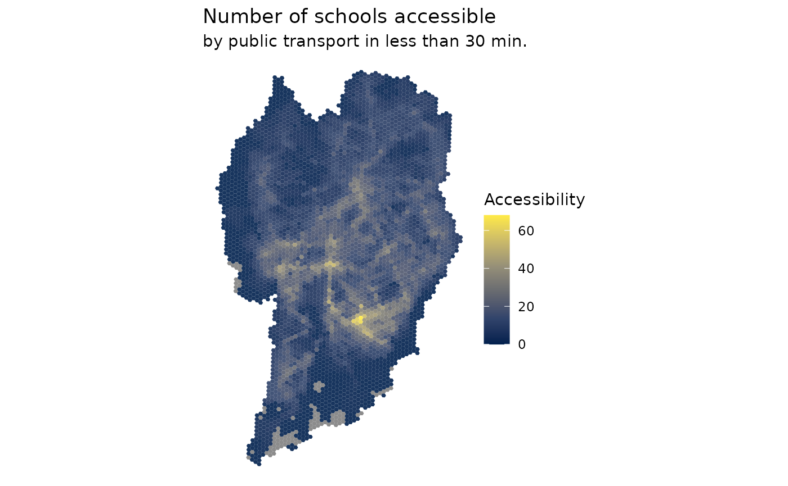

# Mapping urban accessibility

**Load libraries**

``` r
library(aopdata)
library(sf)
library(ggplot2)
library(data.table)
library(scales)
```

## Download accessibility data

``` r
# download aop data
df <- aopdata::read_access(
  city = 'Curitiba',
  mode = 'public_transport',
  year = 2019,
  peak = FALSE,
  geometry = TRUE,
  showProgress = FALSE
  )
```

## Map access to job opportunities

``` r
ggplot() +
  geom_sf(data=df, aes(fill=CMATT60), color=NA, alpha=.9) +
  scale_fill_viridis_c(option = "inferno", labels = scales::comma) +
  labs(title='Number of jobs accessible', fill="Accessibility",
       subtitle='by public transport in less than 60 min.') +
  theme_void()
```



## Map access to schools

``` r
ggplot() +
  geom_sf(data=df, aes(fill=CMAET30), color=NA, alpha=.9) +
  scale_fill_viridis_c(option = "cividis", labels=scales::comma) +
    labs(title='Number of schools accessible', fill="Accessibility",
       subtitle='by public transport in less than 30 min.', fill="N. of schools") +
  theme_void()
```


