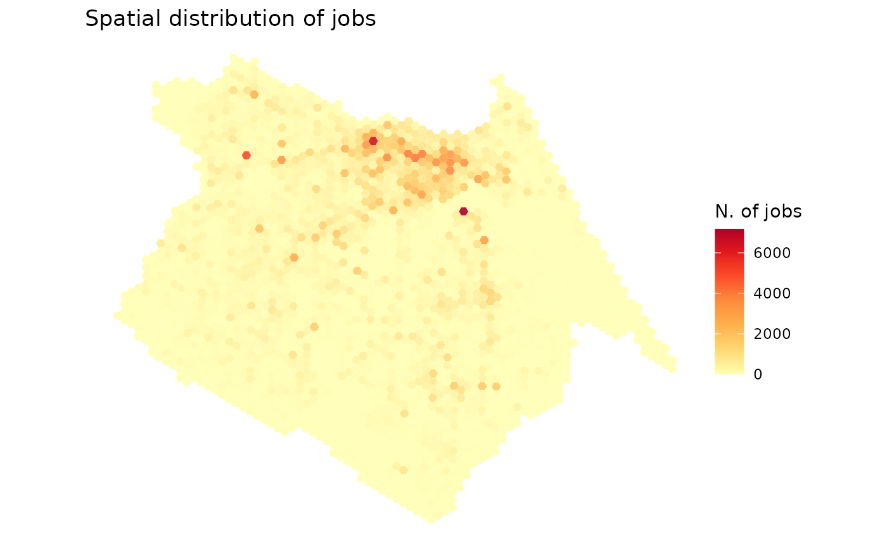
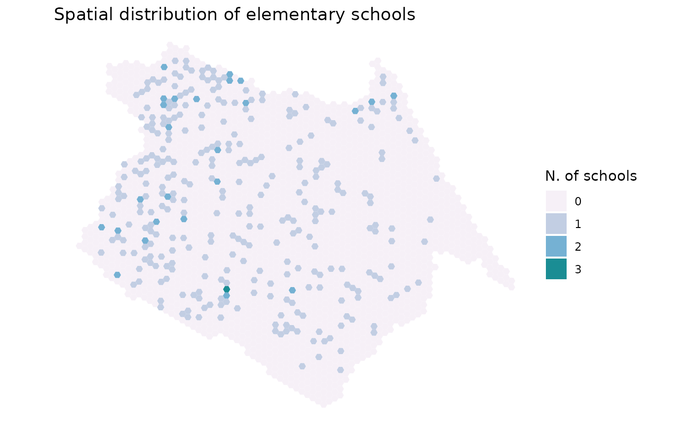
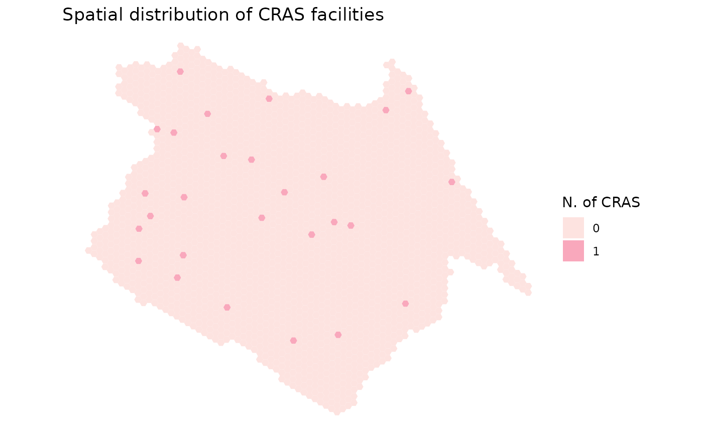

# Mapping land use data

Here are a few quick examples to illustrate how you can use the
{aopdata} package to map the spatial distribution of activities and
urban services in Brazilian cities.

``` r
# load libraries
library(aopdata)
library(data.table)
library(ggplot2)
library(sf)
library(scales)
```

## Download land use data

``` r
df <- aopdata::read_landuse(
  city = 'Fortaleza',
  year = 2019,
  geometry = T,
  showProgress = F
)
```

## Spatial distribution of jobs

``` r
ggplot() +
  geom_sf(data=df, aes(fill=T001), color=NA, alpha=.9) +
  scale_fill_distiller(palette = "YlOrRd", direction = 1) +
  labs(title='Spatial distribution of jobs', fill="N. of jobs") +
  theme_void()
```



``` r
if (!is.null(df)) {
  ggplot() +
    geom_sf(data=df, aes(fill=T001), color=NA, alpha=.9) +
    scale_fill_distiller(palette = "YlOrRd", direction = 1) +
    labs(title='Spatial distribution of jobs', fill="N. of jobs") +
    theme_void()
}
```



## Spatial distribution of schools

In this case below, elementary schools with the column`E003`.

``` r
ggplot() +
  geom_sf(data=df, aes(fill=factor(E003)), color=NA, alpha=.9) +
  scale_fill_brewer(palette = "PuBuGn", direction = 1) +
  labs(title='Spatial distribution of elementary schools', fill="N. of schools") +
  theme_void()
```



## Spatial distribution of healthcare

In this example, we mape high-complexity health care facilities (column
`S004`).

``` r
ggplot() +
  geom_sf(data=df, aes(fill=factor(S004)), color=NA, alpha=.9) +
  scale_fill_brewer(palette = "YlGnBu", direction = 1)+
  labs(title='Spatial distribution of hospitals', fill="N. of hospitals") +
  theme_void()
```


## Map Centers for social assistance (CRAS)

``` r
ggplot() +
  geom_sf(data=df, aes(fill=factor(C001)), color=NA, alpha=.9) +
  scale_fill_brewer(palette = "RdPu", direction = 1)+
  labs(title='Spatial distribution of CRAS facilities', fill="N. of CRAS") +
  theme_void()
```


